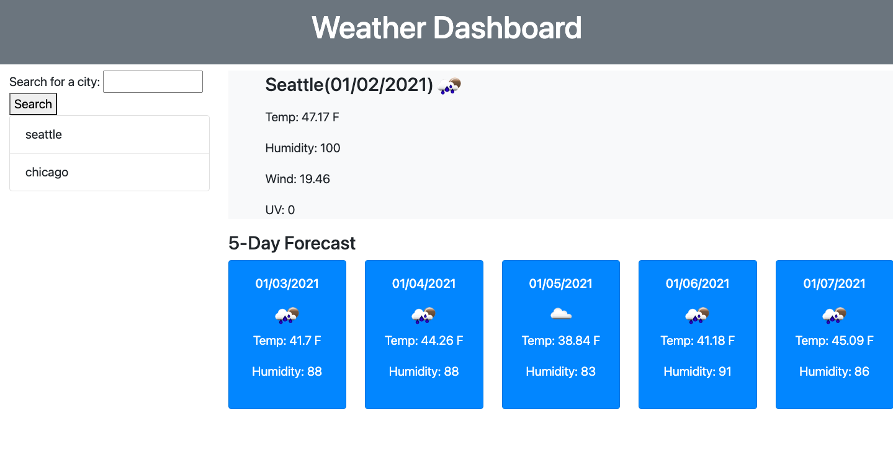

# Weather-Dashboard

In this assignment I created a website that you can look at the current weather and it will also give you the next five days. 

You will look up a city and it will show the weather and when you search another city the previous city will save in the local storage. 

-- After searching for the city it will give you the current date temp, humidity, wind, UV and the next 5 days.